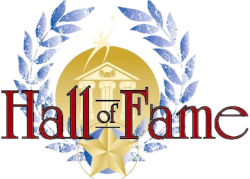

    <a href="MMM/">
        Learn More About MMM Cars
    </a>&nbsp;&blacktriangleright;

<h2 class="divider">About the Register</h2>

The North American MMM Register was created in 1989 by Jerry Keuper
to provide a means of communication among owners of MMM cars in North America.

"MMM" refers to Midget, Magna and Magnette: the overhead cam MGs
produced between 1929 and 1936.

Currently 142 members participate in the Register.
The members own a total of 217 MMM cars encompassing 21 different models (although 459 cars
have been known to the Register). Publications sent to members in good standing include
the "N.A. MMM Newsletter" and the "N.A. MMM Annual Directory".

The [NAMMMR Purpose & Guidelines document](guidelines-and-purposes)
contains Definitions and Qualifications for authentic MMM cars as recognised
by the MGCC UK, Triple-M Register and published in their Register Directory,
as well as our own.

<h2 class="divider">Hall of Fame</h2>

Honoring past Register leaders for their dedication to the preservation of MG history,
for contribution of time and knowledge to preserve the heritage of MG MMM cars
in North America through the North American MMM Register.

Mr. Jerry Keuper   1988 - 1991

Mr. Bill Tantau   1991 - 2012

<h2 class="divider">NAMMMR Officers</h2>

<table class="officers">
<tr>
    <td class="title">Chairman</td>
    <td>Jack Kahler</td>
    <td><a href="mailto:mgjack@aol.com">mgjack@aol.com</a></td>
</tr>
<tr>
    <td class="title">Past Chairman</td>
    <td>Bill Tantau</td>
    <td><a href="mailto:bill707@earthlink.net">bill707@earthlink.net</a></td>
</tr>
<tr>
    <td class="title">Vice Chairman</td>
    <td>Tom Metcalf</td>
    <td><a href="mailto:MGTOM@zoominternet.net">MGTOM@zoominternet.net</a></td>
</tr>
<tr>
    <td class="title">Secretary</td>
    <td>Alan Magnuson</td>
    <td><a href="mailto:alanmg1978@gmail.com">alanmg1978@gmail.com</a></td>
</tr>
<tr>
    <td class="title">Treasurer</td>
    <td>Jack Schneider</td>
    <td><a href="mailto:britjack@comcast.net">britjack@comcast.net</a></td>
</tr>
<tr>
    <td class="title">Newsletter Editor</td>
    <td>Tom Wilson</td>
    <td>&nbsp;</td>
</tr>
<tr>
    <td class="title">Director of Register Events</td>
    <td>Sarah Richey</td>
    <td><a href="mailto:srichey52@gmail.com">srichey52@gmail.com</a></td>
</tr>
<tr>
    <td class="title">Registrar</td>
    <td>Lew Palmer</td>
    <td><a href="mailto:lew@roundaboutmanor.com">lew@roundaboutmanor.com</a></td>
</tr>
<tr>
    <td class="title">Director of Trade Advertising</td>
    <td>Greg Peek</td>
    <td><a href="mailto:gpeek001@icloud.com">gpeek001@icloud.com</a></td>
</tr>
<tr>
    <td class="title">Webmaster</td>
    <td>Casey Duncan</td>
    <td><a href="mailto:casey.duncan+nammmr@gmail.com">casey.duncan@gmail.com</a></td>
</tr>
<tr>
    <td class="title">Manager of Regalia</td>
    <td>Cathy Gunderson</td>
    <td><a href="mailto:j-cg@juno.com">j-cg@juno.com</a></td>
</tr>
<tr>
    <td class="title">Technical Coordinator</td>
    <td>Gary Krukoski</td>
    <td><a href="mailto:garykrukoski@yahoo.com">garykrukoski@yahoo.com</a></td>
</tr>
<tr>
    <td class="title">Register Historian</td>
    <td>Philip Anderson</td>
    <td><a href="mailto:panderson@northpark.edu">panderson@northpark.edu</a></td>
</tr>
</table>

