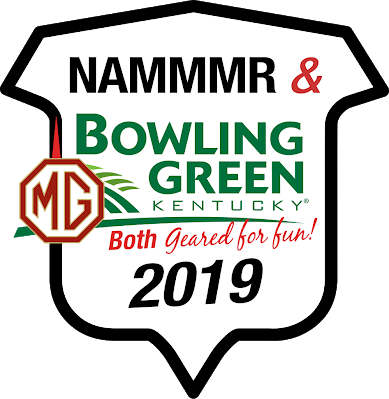

    <section class="event">
        <h2 class="divider green-heading">2019 NAMMMR National Meet 
            &mdash; Bowling Green Kentucky</h2>
        

            
            
June 19 to 22, 2019

            
This year we will be holding our National Meet on our own in
            Bowling Green Kentucky. Members Bill &amp; Sarah Richey will be hosting
            our Register in their home city. Join your fellow MMM members
            for three days of fun and fellowship.

            

            
            <strong>Location:</strong> 
            <a href="https://www.ihg.com/holidayinn/hotels/us/en/bowling-green/bwgwt/hoteldetail">
                Holiday Inn &mdash; University Plaza</a>, 
            Bowling Green Kentucky
            

        

        

            <h3 class="green-heading">Planned Activities</h3>
            <ul>
                <li>Southern BBQ "welcome" meal</li>
                <li>Car show and swap meet</li>
                <li>Tour of Holley Carburetor</li>
                <li>Informational seminar with Tom Wilson</li>
                <li>Traditional Bibulous Gallimaufry at the Montana Grill</li>
                <li>Tour of the Corvette Museum</li>
                <li>Funkana</li>
                <li>Farewell dinner at Federal Grove</li>
            </ul>
        

        

            
            <h3 class="green-heading">M Type Feature Model at Bowling Green!</h3>
            
In order to honor 90 years of MMM motoring, we will be featuring
            the original M-type midget that started it all in 1929! We would
            love to have any and all M-types in attendance for our meet, along
            with all of our beloved MMM motors!

            

                <h3 class="green-heading">Flyer and Registration Form</h3>
                
Click below to download the flyer and registration form for the
                event. We hope to see you in June!

                <a class="doc-thumb" href="events/2019-NAMMMR-bowling-green-flyer.pdf">
                    
                    
Event Flyer

                </a>
                <a class="doc-thumb" href="events/2019-NAMMMR-bowling-green-registration.pdf?cb=aabbaa">
                    
                    
Registration Form

                </a>
            

        

    </section>
    <section class="event">
        <h2 class="divider">67th Annual Rallye Glenwood Springs</h2>
        
        
June 7-9, 2019

The MG Car Club - Rocky Mountain Centre invites you to join us for the
67th Annual Rallye Glenwood Springs, the oldest continually-held
Time-Speed-Distance Rallye in the United States, on Friday, Saturday,
and Sunday, June 7-9, 2019.

The weekend is a marvelous opportunity for sports car enthusiasts of
every marque to come together for sunny days, cool nights, and unique
events.  The fun begins on Friday with the Time-Speed-Distance Rallye,
which will take you through some beautiful scenery on the way to
Glenwood Springs.  Saturday’s main event is a more relaxed tour, with
a fun murder-mystery twist.

To celebrate 90 years of MG sports cars, this year's featured MG model is the
original M Type Midget. We are expecting a number of MMM cars to be present
for this year's car show.

For more information, and to register, visit the
<a href="https://mgcc.org/rallye-glenwood-springs/">Rallye Glenwood Springs page</a> 
on the MGCC website.
    </section>
	<!--
    

        <a href="events-archive/">Previous Years' Events</a>
        &blacktriangleright;
    

	-->

