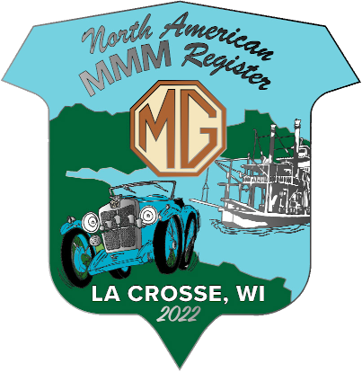

<section class="content divided">
<a class="plain" href="https://mnmgtr.org/gof-central-2022/"><a>

<h2 class="green-heading">Save the Date! NAMMMR National Meet
July&nbsp;11&#8209;15&nbsp;2022</h2>

*The 2022 North American MMM Register Meet will be held July 11-15, 2022 in La
Crosse, Wisconsin.
La Crosse is along the banks of the beautiful Mississippi river.
  
We will be hosted by the Minnesota MG T Register and joining GOF Central 2022.*
  
<a href="https://mnmgtr.org/gof-central-2022/"><em><b>&rarr; Click here for more information and to register!</b></em></a>
</section>
<section class="content divided">
<a class="plain" href="regalia/"><a>

<a class="plain" href="regalia/">
<h2 class="green-heading">New NAMMMR Regalia</h2>
</a>

*Clothing & accessory items are now available for purchase.
We also have a limited supply of NAMMMR grill badges available
while supplies last!
  
Go to our <a href="regalia/">Regalia Page</a> for details!*
</section>
<section class="content">
<a class="plain" href="https://www.hagerty.com/apps/-/CLLTM"><a>

<a class="plain" href="https://www.hagerty.com/apps/-/CLLTM">
<h2 class="green-heading">New NAMMMR Member Benefit</h2>
</a>

*Announcing a NAMMMR Classic Auto Insurance
Discount Program in association with
Hagerty Classic Car Insurance
and the North American Council of MG Registers.*

*This is an offer to NAMMMR members to obtain a 5% discount on
a new or existing Hagerty Insurance Policy.*

*Click on the Hagerty logo to be linked directly to Hagerty's website
for a quote on a policy, including the 5% discount.*
</section>

<aside>
<blockquote>
"Once in a great while someone makes an automobile that is a thing apart from all others, 
an impersonal machine possessing a definite personality... 
...many a man competent to know will argue
that the most completely appealing
and unforgettable personality ever built into a car
was put into the smallest of them all:
The MG Midget."
</blockquote>

Ken W. Purdy, *The Kings of the Road*
</aside>

