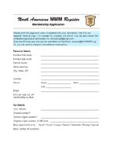
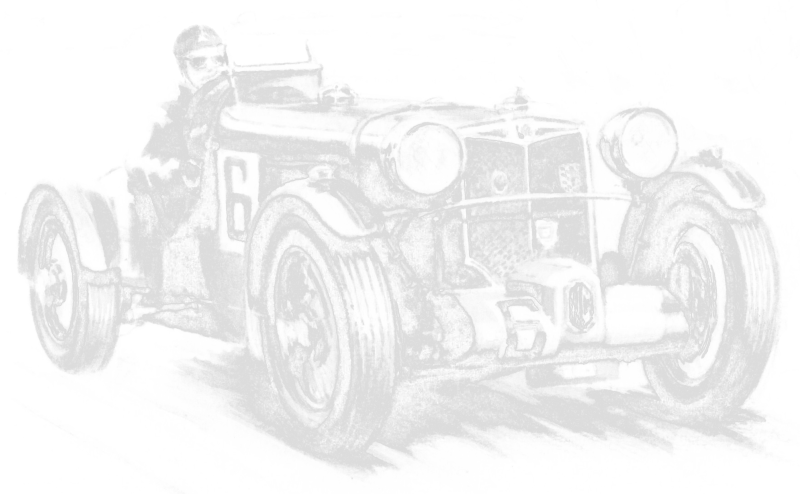

<h2 class="divider">Membership Dues</h2>

Dues are $40 per year worldwide. Dues are due on January 31 of each year. The
dues cover the costs of the publications which are the
"vehicles" for our communications. Past issues of the North American MMM
Newsletters are available for download in the [Newsletters tab](newsletters/)
of this website.

For more information about our club membership and officers, visit the [About
Us page](about-us/)

You can now renew and pay your membership dues directly via PayPal. Use the
button below.

<form class="paypal" action="https://www.paypal.com/cgi-bin/webscr" method="post" target="_top">
<input type="hidden" name="cmd" value="_xclick">
<input type="hidden" name="business" value="renewal@nammmr.org">
<input type="hidden" name="lc" value="US">
<input type="hidden" name="item_name" value="NAMMMR Annual Membership">
<input type="hidden" name="amount" value="40.00">
<input type="hidden" name="currency_code" value="USD">
<input type="hidden" name="button_subtype" value="services">
<input type="hidden" name="no_note" value="0">
<input type="hidden" name="bn" value="PP-BuyNowBF:btn_buynowCC_LG.gif:NonHostedGuest">
<input type="image" src="img/paypal.png" border="0" name="submit" alt="PayPal - The safer, easier way to pay online!">

</form>

<h2 class="divider">Membership Application</h2>

<a class="doc-thumb float-left" href="join/nammmr-application.pdf">
	
	
Application Form

</a>

To apply for membership, download our membership application form and submit
via mail. 

The [NAMMMR Purpose & Guidelines document](guidelines-and-purposes)
contains Definitions and Qualifications for authentic MMM cars as recognised
by the MGCC UK, Triple-M Register and published in their Register Directory,
as well as our own.

